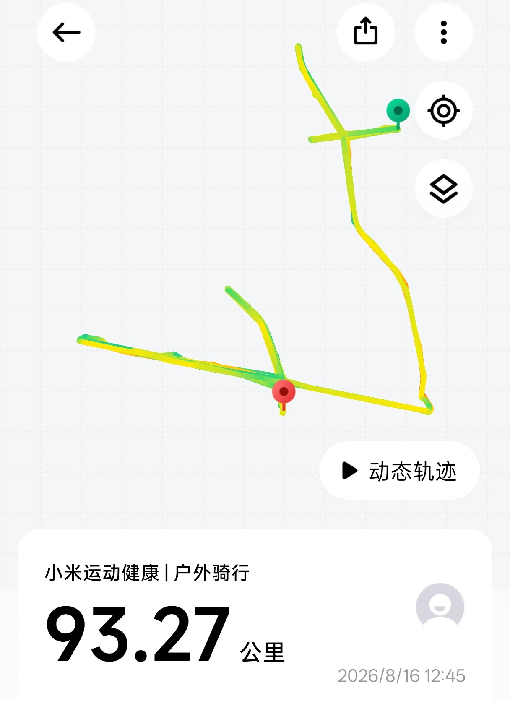

2026-8-16
  带着期待来到了科目三考场，存着自信和期待以及一点紧张我来到了这边练车。我不知道明天会发生什么，是惊喜还是悲伤，我不得知道，但凭借着心中的不稳定，我知道不会是好结局。对着680的来练车费用，我不敢多练，我怕这会是徒劳，一趟送考费320，练车360。问道我要不要练习模拟车时我犹豫的，因为我根本没有把握，从考练车以来，最多只是在路上开过一段，知道人行横道上要点刹，其余都不知道了。所有的相关事项都是在视频中学习到的。对于此次考试我知道胜算不大，也感到胜负已分。  
  8点出发,走的告诉，我们9点就到了，车上坐的满满当当，唯我是第一次来，两个人是第三次考试，都说事不过三，所以他俩不出意外就过了。我和另一个兄弟在科二时一起练过，他车技很好，家里也是修车的，所以他应该也能过。我没练过也没偷偷开过，此次通关率还是未知，对于自己的了解，我觉得大概率就是挂科，所以我没有用模拟车练习，浪费。  

    一天下来把三条线路都练习了，3/4/5号线，我的感觉是3号线最简单，5号线也不错，4号线注意的有点多，练习也练了少一把，所以把握最低，祈求不要给我抽到他就好了。

2026-8-17
