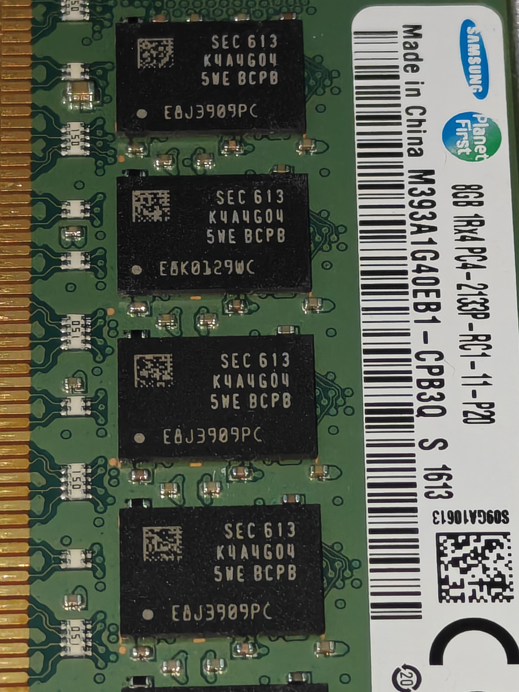

在选购内存的时候很容易买到假的或者货不对板的，学习如何辨别内存信息是非常关键的一门技术。
本篇以三星内存为例，介绍各种编码的含义

## 内存颗粒编码
三星DDR4内存编码规则为 <u>K</u> <u>4</u> <u>A</u> <u>XX</u> <u>XX</u> <u>X</u> <u>X</u> <u>X</u> - <u>X</u> <u>X</u> <u>XX</u> 
各字段含义如下表
| 字段 | 含义  | 例子 |
|-----|:-----:|------|
|第一字段(第1位)|芯片品牌|K：三星内存芯片| 
|第二字段(第2位)|芯片类型|4：DRAM|
|第三字段(第3位)|芯片类型(DRAM Type)|A：DDR4 SDRAM|
|第四字段(第4、5位)|容量(Density)|4G：4Gb；8G：8Gb；AG：16Gb；BG：32Gb|
|第五字段(第6、7位)|芯片结构(位宽) (Bit Organization)|04：x4；08：x8；16：x16|
|第六字段(第8位)|逻辑Bank数量 (#of Internal Banks)|5：16Banks|
|第七字段(第9位)|接口类型与电压(Interface)|6：SSTL(1.5V)；W：POD(1.2V)|
|第八字段(第10位)|内存芯片的修正版本(Revision)|M、A、B、C、D、E、F、G分别代表第1、2、3、4、5、6、7、8版|
|第九字段(第11位)|内存芯片的封装方式 (Package Type)|B：FBGA(Flip chip)；M：FBGA(DDP)；2:FBGA(2H HSV) 3：FBGA(2H 3DS)；4：FBGA(4H TSV)；5：FBGA(4H 3DS)|
|第十字段(第12位)|工作温度与能耗 (Temp&Power)|C：商业温度(0°C\~85°C)和正常能耗 I：工业温度(-40°C~95°C)和正常能耗|
|第十一字段(第13、14位)|内存芯片的速度标志(Speed)|PB:DDR4-2133(1066MHz@cl=15,TRCD=15,tRP=15)； RC:DDR4-2400(1200MHz@cl=17,TRCD=17,tRP=17)； TD:DDR4-2666(1333MHz@cl=19,TRCD=19,tRP=19)； RB:DDR4-2133(1066MHz@cl=17,TRCD=15,tRP=15)； TC:DDR4-2400(1200MHz@cl=19,TRCD=17,tRP=17)； WD:DDR4-2666(1333MHz@cl=22,TRCD=19,tRP=19)； VF:DDR4-2933(1466MHz@cl=21,TRCD=21,tRP=21)； WE:DDR4-3200(1600MHz@cl=22,TRCD=22,tRP=22)； YF:DDR4-2933(1466MHz@cl=24,TRCD=21,tRP=21)； AE:DDR4-3200(1600MHz@cl=26,TRCD=22,tRP=22)|

 以下图为例解析一个

如图可见这是三星的一条DDR4-2133 8GB的服务器内存
颗粒信息K 4 A 4G 04 5 W E B C PB
那么就是：三星内存芯片，DRAM，DDR4 SDRAM，单颗4Gb，位宽4bit，共16个Bank(实际数有18个，还有两个用于ECC存储校验码，不计入实际存储)，POD1.2v(POD是一种I/O接口电平标准)，第六版，采用FBGA(Flip chip)封装,商业温度，DDR4-2133(1066MHz@cl=15,TRCD=15,tRP=15)。

这么看来这条内存和标签完全一致，那么这是一条纯血的三星内存。

## 标签编码
### 消费级SO-DIMM/DDR/U-DIMM
格式：<u>M</u> <u>X</u> <u>XX</u> <u>A</u> <u>XX</u> <u>X</u> <u>X</u> <u>X</u> <u>X</u> <u>X</u> - <u>X</u> <u>XX</u>

|字段|含义|例子|
|----|----|----|
|第一字段(第1位)|内存模块|M|
|第二字段(第2位)|模块类型|3：DIMM；4：SODIMM|
|第三字段(第3、4位)|数据位|71: X64 260PIN UNBUFFERED SODIMM 74: X72 260PIN ECC UNBUFFERED SODIMM 78: X64 288PIN UNBUFFERED DIMM 86: X72 288PIN LOAD REDUCED DIMM 91: X72 288PIN ECC UNBUFFERED DIMM 92: X72 288PIN VLP REGISTERED DIMM 93: X72 288PIN REGISTERED DIMM|
|第四字段(第5位)|内存颗粒类型|A：DDR4 SDRAM(1.2V VDD)
|第五字段(第6、7位)|颗粒容量|56：256M；51：512M；1G : 1G 2G : 2G；4G : 4G；8G: 8G AG: 16G；1K : 1G (FOR 8Gb)；2K : 2G (FOR 8Gb)； 4K : 4G (FOR 8Gb)；8K : 8G (FOR 8Gb)；AK: 16G
|第六字段(第8位)|补偿BLANK位接口|4：16BANKS&POD-1.2v|
|第七字段(第9位)|颗粒位宽|0：x4；3：x8；：4：x16|
|第八字段(第10位)|颗粒版本|与颗粒编码一致|
|第九字段(第11位)|封装方式|与颗粒编码一致|
|第十字段(第12位)|PCB版本|0、1、2、3、4分别代表NONE、1、2、3、4版|
|第十一字段(第13位)|工作温度与能耗|与颗粒编码一致|
|第十二字段(第14、15位)|速度标志|与颗粒编码一致|

解码示例（M 4 71 A 2K 4 3 C B 1 - C TD）：

这是一个SODIMM(笔记本内存)，数据位宽64bit，有260个金手指，Unbuffered(无缓冲，最常见的内存模组)，内存颗粒单科8Gb，16个颗粒，POD-1.2V，颗粒第四版，颗粒位宽8bit，封装方式FBGA(Flip chip)，PCB版本第一版，温度商业温度，正常能耗，速度2666(1333MHz@cl=19,TRCD=19,tRP=19)

### 企业级RDIMM/LRDIMM命名
专为服务器设计，含ECC校验 
示例（M393A1G40EB1 - CPB3Q）
M393：RDIMM内存
A：DDR4(B：DDR3；C：DDR5)
1G40：单颗容量1Gb,位宽4bit
EB1：颗粒版本/PCB版本
CPB：C代表商业温度，PB是速率标志

***
累死我了，最后企业级命名有点水，emm  
如果这篇文章对你有用不要忘记留言哦~
***
参考文献
- 《计算机组装与维护-第三版》
- <https://www.alldatasheet.co.nz/ai/ai.jsp?Searchword=M393>
- <https://www.elecfans.com/zt/21807/>
- <https://zhuanlan.zhihu.com/p/653692576>

