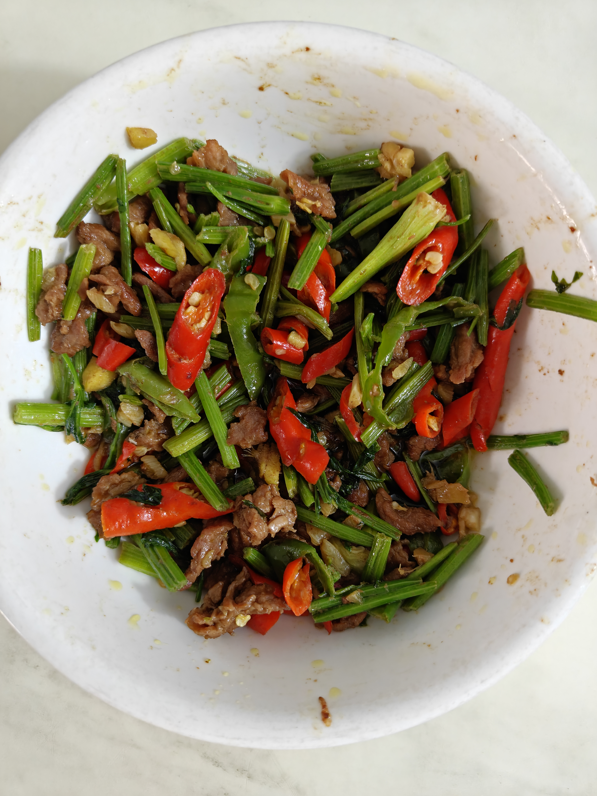

一样的没有图片哈，被攻击了😭  
结尾有残局

参考B站UP **村驴**  
[戳我去炒](https://www.bilibili.com/video/BV1fCGSzJEFD/?share_source=copy_web&vd_source=047d67508fa4aa60e5965394c8b79c09)  

***
## 准备阶段  
1.炒牛肉你不切片？  

2.**腌制**：`盐，鸡精，胡椒粉，小苏打，老抽`,小苏打不要多加。    
            抓匀加入葱姜水，充分吸收再次加入葱姜水。  
            继续抓匀，有点黏黏的再次加入，继续搅拌。  
            搅拌到有点阻力把剩下的全部加入。  
            加入淀粉抓匀。最后加入油锁住水分。

3.制作葱姜水：食指长的葱白，指关节大的姜。通通拍扁。放入小碗，加入一点水，用力挤出汁水  

4.姜蒜切碎，芹菜切段（可用香菜代替,不论哪种有点叶子会好看点），青红椒斜切小块马蹄状。  

***
## 制作阶段
1.锅热加一点油，让锅子周围沾满油，防止粘锅。完毕加油。  

2.牛肉下入，水分较多会出现较多的汁水，均匀翻炒，稍等一会，等汁水蒸发。  

3.微微出现油，牛肉撇到一边，下姜蒜。牛肉给他盖起来，充分加热一会。  

4.爆炒出香味，继续撇到一边，下辣椒，盖起来，充分加热。

5.下入生抽，耗油，白糖。爆炒融合

6.稍等一会，爆炒到感觉牛肉快熟，下芹菜，爆炒。可以准备一点淀粉水勾芡下，这样吃起来牛肉上会有较多汁水，也可以在芹菜还没完全熟，但是油较少时避免烧焦。  

7.芹菜熟了就可以出锅。  

***
香辣下饭，芹菜香，辣椒也好吃，一口下去全是料。  
最后贴上图片  
