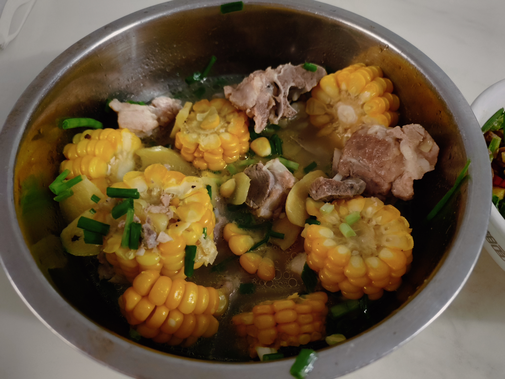

这次封面没放图片，因为还没拍照就被攻击了。。。有吃剩下的，可以去篇尾康康  
**总结**：难度一般，最重要的是去除肉腥味，后面基本不用管，高压锅控制时间就好了。味道鲜美，没有异味，很香。  

参考了B站UP **阿光美食记**  
[戳我炖汤](https://www.bilibili.com/video/BV1rA4sewEMm/?share_source=copy_web&vd_source=047d67508fa4aa60e5965394c8b79c09)  
***
## 准备阶段
**关键**：去除肉腥味  
1.排骨洗净，放入大碗，加入盐，一点点小苏打。盐用于杀菌和排除血水，小苏打用于嫩肉。浸泡十分钟。  

2.苞米去皮切成合适大小，稍微洗洗  

3.准备葱和姜。小葱打结(大葱切段)。姜切片  

4.洗净排骨  

## 制作阶段  
因为条件有限所以结合自己经验稍微修改了下  

1.锅中烧油，油热下入排骨。排骨微微金黄色下入葱姜炒香。  

2.加**热水**没过排骨，稍等一会瓢去白沫（**很关键！！**），完毕后转入高压锅。  

3.高压锅压个10分钟。  

4.等待压力下来，加入玉米，加一点点盐和白糖。可以把刚开始加的葱结捞出。  

5.压力5分钟即可出锅。  

***
好了，这就是全部的流程，不用加太多的调料，味道也是非常鲜美，汤汁清甜没有杂味，玉米香味浓厚。  
最后附上图片  

