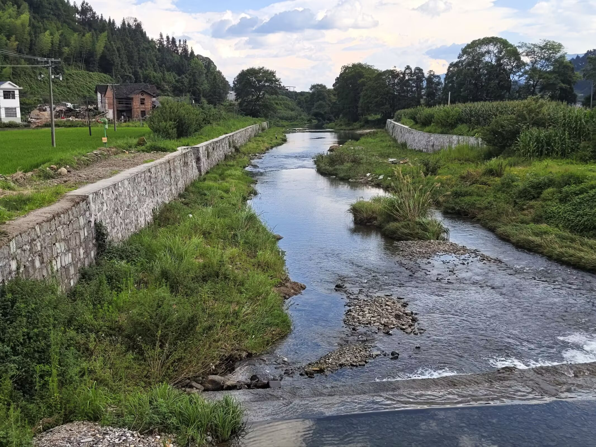

  起初，鼠鼠因为长期在家，发现身上长出了霉菌（bushi），鼠鼠于是决定必须得多出去走走了。于是想起了自己的小单车，嘿嘿，去骑行我还挺喜欢的，所以在昨天召回了我的小单车。  

  7.14我从家里徒步去找劳biu，虽然有10公里距离，但这也是应该熟悉的路才对，在以我家为中心向外辐射10公里的范围内我都应该熟悉才对，这样才算个真正的本地人嘛。所以我直接徒步去，下午13点，正式太阳最大的时候，刚走出家门不久我便感受到太阳毒辣，身体不断向外冒汗，呃~我要失败了吗？我想这打个车吧，太累了。走着走着，我来到了街上，在太阳下呆久了，我也慢慢适应了温度，也不再那么畏难了，所以我更打算走过去了。  

  背起了行囊，一路上还挺好玩，看着沿途上的风景，我对这条路更熟悉了，原来只是在车上看着，现在走在路上，路边不是刷新一些好玩的小玩意（滑稽）。走到河边，河风吹在身上很舒服，热意全无，树荫下很凉快，空气很清新，看着清澈的河水，刚好可以淌过去取，在这夏日，我真想下去好好玩玩水。过了这片树林就快到劳biu家了，不久我也是顺利拿到了小自行车。劳biu也有个小自行车，原来是坏的，所以借了我的，因为我召回，所以他拿去修了，这时他提议去闪击杰哥，emmm，杰哥也快发霉了吧，必须好好教训下，我们决定明天就去。  

  回家路上我本来想着去游泳的，可惜发现草履虫要回去了，时间也不早，我也得去做饭了，所以就不去游泳了，我问他们去不去骑行，去闪击杰哥，他们也是答应了。嘿嘿，这下子事情就变得有意思起来了。  

  事情来到今天，早上我去换台，因为原本的胎是补上的，所以好像有点漏气，刚好劳biu还给了我一个好的胎所以我就去店里换了。没想到老板看到我自己备了胎让我自己换，我本想出点钱让老板给我换，看来又只能自己换了。还行，换起来不是很难，也是成功换上去了。期间彪妈和彪爸来修风扇，认出我了，那时我正在和老板交谈。好热情，嘿嘿。  
  
  整理完毕我们拿上装备，我没什么拿的。草履虫倒是包裹的严严实实，可能是晒怕了吧，不想永久变成negro，所以整了防晒和冰丝袖套。确实黑了不少，从脖颈上来看确实好黑。开始上路喽，一路顺畅直到到了上山的路，我去，这么可以这么长，这简直是飙车的好地方，U型弯，连续急弯，S弯，下来爽，上去可是一种煎熬。杰哥给的定位尽然是坟包？？定位不偏不倚的定到了坟包上，呵呵，杰哥的秘密基地吗。在山里定位就是要偏移一些，最后到达的地方和定位快偏了1公里。还行，至少没走错路。  

  也是到了杰哥家里，嘿嘿，杰哥，嘿嘿~  

  杰哥的小房间也是非常的不错，这种衣柜当墙真的挺爽的，窗户面对梨子园，加上一个挺高级的桌子，干净整洁不失风度，在这里还挺爽的。杰哥家人也是非常的热情，本来只是来康一眼，这么一下得留下来吃饭了，和我猜的不错，吃了饭后也快黑了，还要被留下来过夜，果然不错。天热情了。晚饭很香，这么好吃这么都不装第二晚，是害羞羞吗，作为一个i人，大家都不加我也不好意思了，即使真的非常想再来一碗。  

  吃饱上路回去就快了，上个山的时间就可以到家了。回到家累了，躺下，汗还不停的出。来回40公里，难忘的一次经历，可能我这辈子可能都破不了上次113公里的记录【火车山上的骑行（doge）】，但路途上的意义本身就意义重大了。  
  没拍照有点后悔了。。

